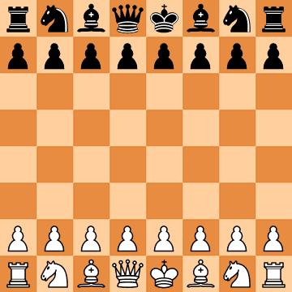

# chess2pic
A tool for visualizing chess positions and games



## Features

 - parse FEN positions and turn them into PNG images
 - parse PGN games and turn them into GIF animations

*note: current parsers have limited capabilities,* *~~refer to docs for more info~~ TODO: add parser documentation*


## Prerequisites

 - go 1.17+
 - [go-swagger](https://goswagger.io/install.html)


## Build

```bash
make build
# binaries will be in build/ directory
```


## Usage

Visualize position from FEN notation:
```bash
chess2pic -notation fen -data "rnbqkbnr/pppppppp/8/8/8/8/PPPPPPPP/RNBQKBNR"
```

Or from file:
```bash
chess2pic -notation fen -in position.fen
```

Create GIFs from PGN games in a similar way:
```bash
chess2pic -notation pgn -in game.pgn
```

You can also look from black's side of the board:
```bash
chess2pic -notation pgn -in game.pgn -from black
```

Use `chess2pic -help` for full info on command line arguments.


## API server

chess2pic also provides a REST API server. You can check out its Swagger 2.0 spec [here](./api/chess2pic-api.yaml). After building the binaries run the server with
```bash
make run-api
```

Server will be listening on http://localhost:65000 (Swagger UI is awailable on http://localhost:65000/docs).

You can also check out [chess2pic web app](https://github.com/xopoww/chess2pic-web)!

## License

This software is distributed under MIT License (see [LICENSE.txt](LICENSE.txt)). Note that this project uses thrid party media files distributed under CC BY-SA 3.0, see [this file](pkg/pic/assets/img/LICENSE.txt) for details.